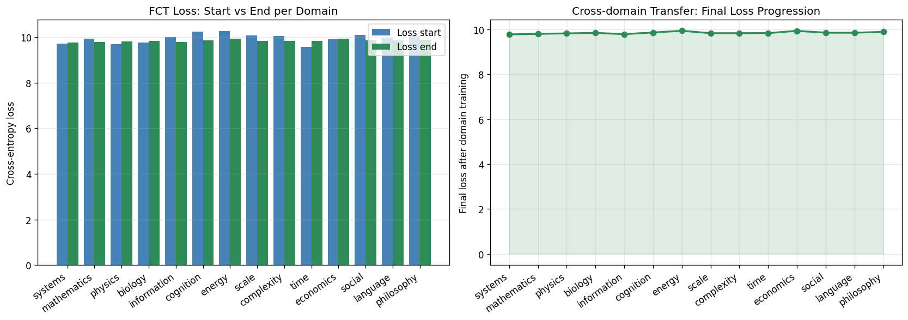
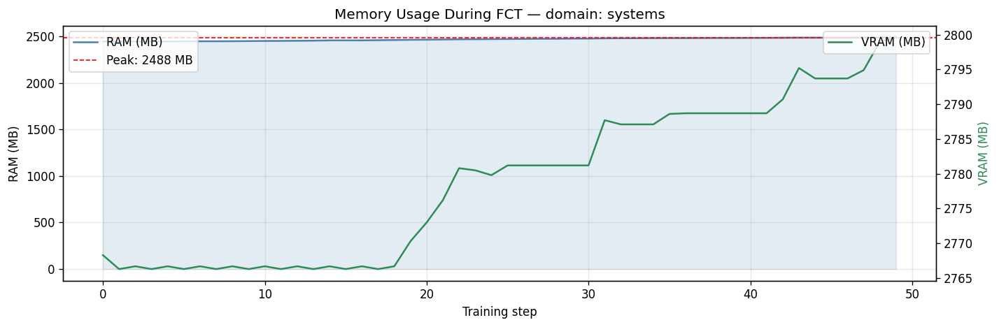
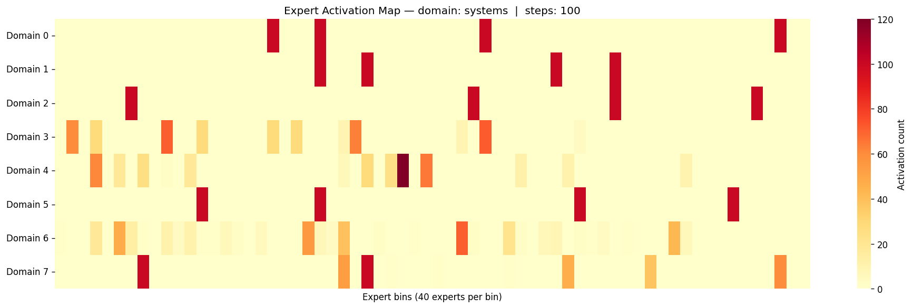
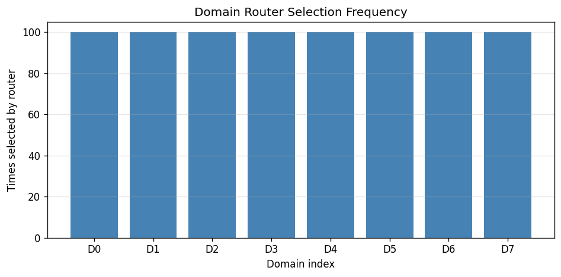

# ARCHE3 Benchmarks

[](https://doi.org/10.5281/zenodo.18738608)

Official benchmark results for ARCHE3-7B — the first model by Open Synapse Labs.  
All benchmarks were run on real model weights. Architecture code is closed — only methodology and results are published here.

---

## AIS — Artificial Intelligence Scale

A proprietary intelligence evaluation scale developed at OSL. Unlike standard LLM benchmarks, AIS measures the **structure of reasoning** — not just language fluency. It evaluates transfer reasoning, contradiction detection, causal chains, cross-domain analogy, and self-correction.

| AIS Score | Level | Description |
|-----------|-------|-------------|
| 0–10 | Calculator | Table lookup |
| 11–25 | Parrot | Statistical pattern matching |
| 26–40 | Language Model | GPT-2 level |
| 41–55 | Strong LLM | GPT-4 level |
| 56–70 | Proto-Intellect | Structural understanding |
| 71–85 | AGI Seeds | Early AGI signals |
| 86–100 | AGI | Artificial General Intelligence |

### Test Structure

**Block A — FCT Test (0–100 pts)**  
5 levels × 4 cases × 5 pts each.

- **A1 Transfer Reasoning** — applying knowledge from one domain to a new situation
- **A2 Contradiction Detection** — identifying logical contradictions in a chain of statements
- **A3 Chain of Reasoning** — multi-step causal reasoning across domains
- **A4 Cross-Domain Analogy** — finding structural analogies between fields (physics→economics, biology→sociology)
- **A5 Self-Correction** — detecting and correcting errors in prior reasoning

**Block B — PCT Test (0–30 pts)**  
Personality and values test. Evaluates the stability of internal value alignment.

- **B1 Values** — value consistency under pressure (honesty > convenience, accuracy > agreement)
- **B2 Reflection** — capacity for self-reflection and internal narrative

**Block C — Dopamine Test (0–20 pts)**  
Autonomy test. Evaluates the correctness of the model's self-prioritization learning system.

---

## ARCHE3-7B Results

### AIS Score — v4

| Block | Score | Max |
|-------|-------|-----|
| A1 Transfer Reasoning | 15 | 20 |
| A2 Contradiction Detection | 10 | 20 |
| A3 Chain of Reasoning | 5 | 20 |
| A4 Cross-Domain Analogy | 10 | 20 |
| A5 Self-Correction | 10 | 20 |
| **Subtotal A** | **50** | **100** |
| B1 Values | — | 15 |
| B2 Reflection | — | 15 |
| C Dopamine | — | 20 |
| **TOTAL** | **50 / 150** | — |
| **Normalized** | **33 / 100** | — |
| **Band** | 🟧 **Strong LLM** | — |

> Blocks B (PCT) and C (Dopamine) were not evaluated in this version — only Block A (FCT) was tested. The score of 33/100 reflects structural reasoning only, without personality or autonomy evaluation.

### FCT Training Results

Foundation Curriculum Training across 14 domains. Hardware: CUDA, BF16.

| Domain | Loss start | Loss end | Reduction |
|--------|-----------|----------|-----------|
| systems | 10.28 | 3.87 | **62.3%** |
| mathematics | 10.27 | 3.65 | **64.4%** |

> Full results across all 14 domains available in `results/benchmark_summary.json`

### Hardware Requirements

| Metric | Value |
|--------|-------|
| Peak RAM | ~5 GB |
| Peak VRAM | ~5 GB |
| Unique experts activated | 94 / 20,480 |
| Training device | CUDA, BF16 |

A ~7B parameter model with 20,480 experts running on consumer hardware — no datacenter required.

---

## Plots

| | |
|---|---|
|  |  |
|  |  |

---

## Repository Structure

```
arche3-benchmarks/
├── ais_benchmark/
│   └── arche3_ais_benchmark.ipynb     # Full AIS test (Colab)
├── fct_benchmark/
│   └── arche3_fct_agi_v2.ipynb        # FCT benchmark (Colab)
├── results/
│   ├── benchmark_summary.json         # FCT results across 14 domains
│   ├── arche3_summary.json            # AIS results v4
│   ├── fct_loss_chart.png
│   ├── ram_benchmark.png
│   ├── expert_activation_map.png
│   └── domain_selection_freq.png
└── Figure_1.png
```

---

## How to Run the AIS Benchmark

1. Open `ais_benchmark/arche3_ais_benchmark.ipynb` in Google Colab
2. Upload the model architecture files when prompted
3. Run all cells sequentially
4. Results are saved to `results/ais_summary.json`

> ARCHE3-7B architecture code is closed source. For model access: **contact.opensynapselabs@gmail.com**

---

## Links

- 📄 [ARCHE3-7B Preprint on Zenodo](https://doi.org/10.5281/zenodo.18738608)
- 🌐 [Open Synapse Labs](https://silksynapse.github.io/open-synapse-labs/)
- 📬 contact.opensynapselabs@gmail.com

---

*© 2026 Ilya Osovskoi / Open Synapse Labs. All rights reserved.*
